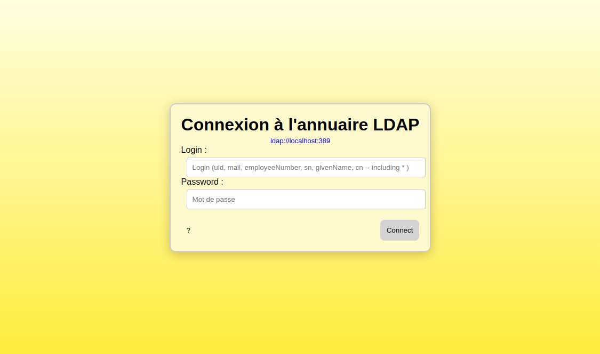
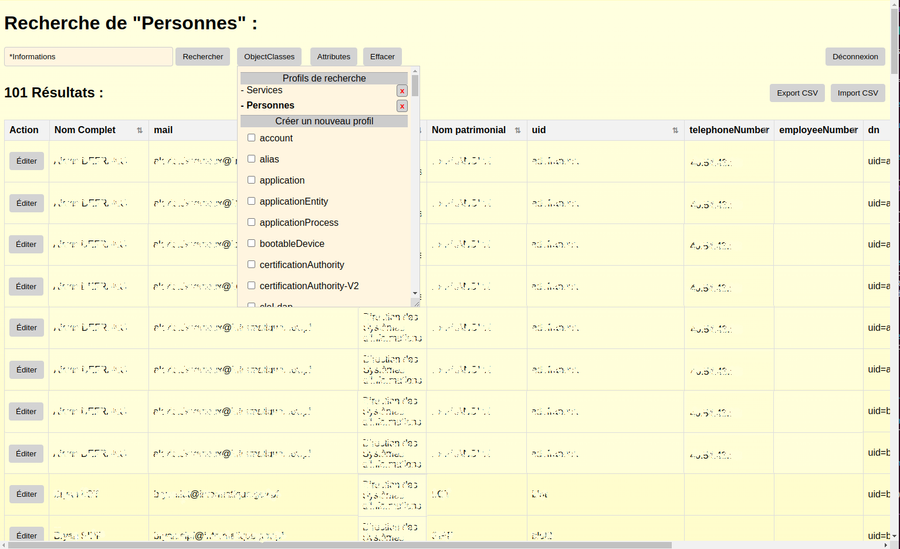
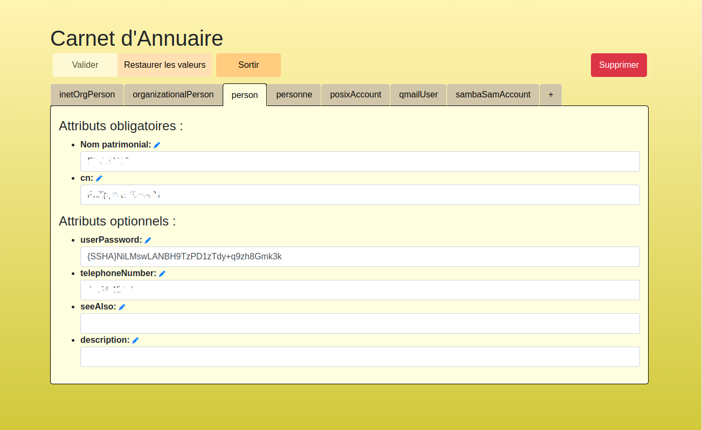
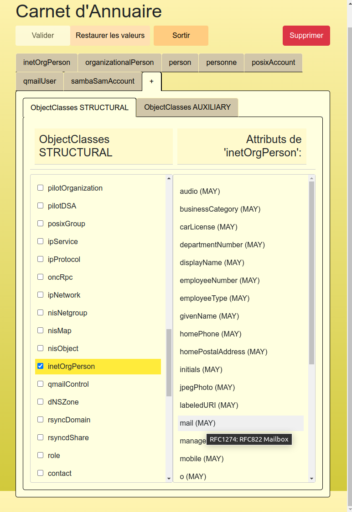

# ldapjs-app
A web application for managing LDAP entries using ldapjs, allowing users to search, edit, and organize LDAP data effectively through an intuitive interface.


Une application nodeJS simple, utilisant la bibliothèque `ldapjs` pour interagir avec un serveur LDAP ; elle permet de rechercher, éditer et gérer des entrées d'une base LDAP via une simple interface web.

Ce projet dérive d'un autre vieux projet écrit en Qt et C++ d'une application client-serveur qui permettait de gérer différents aspects de l'administration d'un réseau d'entreprise : users, groups, dns, serveurs, ressources partagés, crons, firewals, ...

On peut le trouver ici : https://github.com/peychart/libldapcppei (archive : ldapEasyAdminFrontends-1.1.3.tgz), en exemple d'utilisation de la bibliothèque 'ldapcppei' qu'il utilise ; la documentation complète (français/anglais), au format http, se trouve dans le répertoire "webdoc" ...

Ce tout nouveau projet est lui, en quelque sorte, un début de ré-écriture en nodeJS, offrant ainsi un accès beaucoup plus immédiat puisqu'au format web ; mais les principes de fonctionnement restent similaires :

- la lecture du schéma de l'annuaire permet la constitution dynamique des masques de saisie des informations stockées dans la base,
- Le principe d'association 'onglet-objectClass' permet une vision claire des propriétés, facilitant les ajouts et retraits contrôlés des objectClass structurant chacune des entrées créées ou éditées,
- un principe de paramétrage de chacun des attributs (à personnaliser ici en JavaScript) permet de gérer à la fois les contraintes de saisie de chaque attribut d'annuaire mais, également, les contraintes d'intégrité qui peuvent exister entre les attributs eux-mêmes.


NOTICE : Cette ré-écriture n'est pas encore opérationnelle (exemple, la logique des classes n'est pas encore fixée) mais, dans son état actuel, elle peut déjà être testée permettant ainsi d'envisager les principes de l'interface visée.


## Table des matières

- [Fonctionnalités](#fonctionnalités)
- [Installation](#installation)
- [Configuration](#configuration)
- [Utilisation](#utilisation)
- [Fonctions Utilitaires de contrôle des saisies](#Fonctions-utilitaires-de-contrôle-des-saisies-dattributs)
- [Contribuer](#contribuer)
- [Licence](#licence)


## Fonctionnalités

- Connexion à un serveur LDAP,
- Recherche d'entrées LDAP par UID, CN, prénom, ou numéro d'employé (à terme, sera paramétrable au sein de l'interface),
- Édition des attributs des entrées LDAP,
- Gestion des formats et des contraintes d'intégrité entre champs de saisie,
- ajout d'objectClass aux entrées existantes et création de nouvelles entrées,
- importation de fichiers CSV pour création d'entrées en masse,
- etc.


#  Installation

Pour exécuter cette application, suivre ces étapes :

1. Cloner ce dépôt :

```
bash
git clone https://github.com/peychart/ldapjs-app.git
cd ldapjs-app
```

2. Installer les dépendances :

```
bash npm install nodejs
bash npm install cookie-parser
bash npm install express-session passport passport-ldapauth
bash npm install winston            // Journalisation en fichier log
bash npm install winston-daily-rotate-file
```


## Configuration

Avant de démarrer l'application, il conviendra d'ajuster les informations du contexte LDAP :
* Renommer le fichier config.example.json en config.json,
* chmod 600 config.json,
* vérifier l'appartenance du fichier,
* Modifier le fichier config.json pour y inclure les informations propre à la base LDAP à éditer.

Un exemple de fichier config.json est présenté ici :

```
{
    "nodeJsPort: 3000,
    "ldap": {
        "url": "ldap://localhost:389",
        "port": 389,
        "base": {
            "bindDN": "cn=admin,dc=example,dc=com",
            "bindPassword": "secret",
            "baseDN": "dc=example,dc=com"
        },
        "schema": {
            "baseDN": "cn=schema",
            "bindDN": "cn=admin,dc=example,dc=com",
            "bindPassword": "schemaPassword"
        }
    },
    "configDn": {
        "root": "ou=carnetLDAP,ou=applications,dc=example,dc=com",
        "attributs": "ou=attribut"
    },
    "logFile": "log/application.log",
    "sessionSecret": "votre_secret_complexe"
}
```

Explications :
* l'entrée "ldap" définie l'accès à la base ; il doit être read/write,
* l'entrée "schema" définie l'accès à son schéma ; un readOnly est suffisant,
* l'entrée "configDn.root" définie le lieu de stockage dans la base du paramétrage de l'application :
   * définitions associées aux attributs,
   * logique des classes (associations métiers, attributs de recherche, etc.)
   * ...


## Utilisation

Pour démarrer l'application, exécuter :

```
node app.js (ce démarrage pourra être plus tard configuré en service).
```

Ouvrir un navigateur et appeler le lien suivant : http://localhost:3000.


## Routes disponibles à ce jour

* GET / : Page d'accueil pour la recherche LDAP.
* POST /search : Effectue une recherche sur les entrées LDAP.
* GET /edit/:dn : Accède à la page d'édition d'une entrée LDAP.
* POST /update-attributeCtl : Met à jour le format des attributs d'une entrée LDAP.
* GET /logout : Déconnexion et réinitialisation de la connexion LDAP.


## Fonctions utilitaires de contrôle des saisies d'attributs

1. Contrôle de la frappe sur l'attribut 'sn' et mise à jour du 'cn' effectuée en parallèle:

```
function check(input, data, initialValue) {
 // Convertit les frappes en majuscules  
 input.value = input.value.normalize('NFD').replace(/[\u0300-\u036f]/g, '');
 input.value = input.value.toUpperCase();

 // Calcul automatique du 'cn' à partir de (givenName+' '+input.value)
 const givenName = document.getElementsByName("givenName")[0];
 document.getElementsByName('cn').forEach(el => {el.value = (givenName.value + ' ' + input.value).trim();});
}
```


2. Blocage de la frappe sur l'attribut 'cn' (readOnly, puisque calculé)' :

 


3. Contrôle de la frappe sur l'attribut 'givenName' et mise à jour du 'cn' effectuée en parallèle :

```
function check(input, data, initialValue) {
 // Convertit les frappes en majuscules et minuscules non accentuées
 input.value = input.value.normalize('NFD').replace(/[\u0300-\u036f]/g, '');
 input.value = input.value.charAt(0).toUpperCase() + input.value.slice(1).toLowerCase();

 // Calcul automatique de 'cn' à partir de ${input.value+' '+sn}
 const sn = document.getElementsByName("sn")[0];
 document.getElementsByName('cn').forEach(el => {el.value = (input.value + ' ' + sn.value).trim();});
}
```

4. Exemple de popup de saisie d'un mot de passe SSHA :


```
function check(input,data,initialValue){
input.value=initialValue;
const s=document.createElement('script');
s.src="https://cdnjs.cloudflare.com/ajax/libs/crypto-js/4.0.0/crypto-js.min.js";
s.onload=function(){const style=document.createElement('style');
style.textContent=".overlay{position:fixed;top:0;left:0;width:100%;height:100%;background:rgba(0,0,0,.5);z-index:999;display:none}.popup{position:fixed;left:50%;top:50%;transform:translate(-50%,-50%);background:yellow;border:1px solid black;padding:20px;z-index:1000;box-shadow:0 0 10px rgba(0,0,0,.5);display:flex;flex-direction:column;align-items:flex-start;width:600px}.popup h2{margin:0;margin-bottom:10px}.popup .input-container{display:flex;width:100%}.popup input{flex:1;padding:10px;font-size:16px;margin-right:10px}.popup button{padding:10px 15px;margin-left:5px;border:none;cursor:pointer}#submitPassword{background:#FFFFF0}#closePopup{background:#FFE0B2}";
document.head.appendChild(style);
const overlay=document.createElement('div');overlay.className='overlay';const popup=document.createElement('div');popup.className='popup';
popup.innerHTML="<h2>Entrez votre mot de passe</h2><div class='input-container'><input type='password' id='passwordInput' placeholder='Votre mot de passe'/><button id='submitPassword'>Soumettre</button><button id='closePopup'>Annuler</button></div>";
document.body.appendChild(overlay);document.body.appendChild(popup);overlay.style.display='block';const passwordInput=document.getElementById('passwordInput');passwordInput.focus();const submitButton=document.getElementById('submitPassword');
submitButton.onclick=function(){const password=passwordInput.value,salt=CryptoJS.lib.WordArray.random(8).toString(),hashedPassword=CryptoJS.SHA1(password+salt).toString();input.value=`{SSHA}${hashedPassword}`;closePopup();};
passwordInput.addEventListener('keypress',function(e){if(e.key==='Enter'){submitButton.click();}});
function closePopup(){overlay.style.display='none';document.body.removeChild(overlay);document.body.removeChild(popup);document.head.removeChild(style);}document.getElementById('closePopup').onclick=closePopup;overlay.onclick=closePopup;};
document.body.appendChild(s);
}
```

Ce qui donnera :

 


5. Exemple de contrôle de format date :

```
function check(input, data, initialValue) {
 let value = input.value.replace(/[^0-9/]/g, '').replace(/\/+/g, '/');
 if (value.length === 3 || value.length === 6) value = value.slice(0, -1) + '/';
 if ((value.length === 1 && parseInt(value.slice(0, 1), 10) > 3) ||
  (value.length < 3 && parseInt(value.slice(0, 2), 10) > 31) ||
  (value.length < 5 && parseInt(value.slice(3, 4), 10) > 1) ||
  (value.length < 6 && parseInt(value.slice(3, 5), 10) > 12) ||
  (value.length > 2 && value[2] !== '/') ||
  (value.length > 5 && value[5] !== '/') ||
  (value.length > 10)
 ) value = value.slice(0, -1);
 input.value = value;
 // Validation ou annulation sur sortie du champ de saisie
 const changeHandler = input.onchange = function() {
  if (!isValidDate(value)) input.value = initialValue; 
  input.removeEventListener('change', changeHandler);
};}
function isValidDate(value) {
 const regex = /^(0[1-9]|[12][0-9]|3[01])\/(0[1-9]|1[0-2])\/(\d{4})$/;
 if (!regex.test(value)) return false;
 const parts = value.split('/');
 const day = parseInt(parts[0], 10);
 const month = parseInt(parts[1], 10);
 const year = parseInt(parts[2], 10);
 const daysInMonth = [31, (isLeapYear(year) ? 29 : 28), 31, 30, 31, 30, 31, 31, 30, 31, 30, 31];
 return month >= 1 && month <= 12 && day >= 1 && day <= daysInMonth[month - 1];
} function isLeapYear(year) {return (year % 4 === 0 && year % 100 !== 0) || (year % 400 === 0);}
```

6. Exemple de contrôle de format IPV4 :

```
// WARNING: SINGLE-VALUE attribute only:
function check(input, data, initialValue) {
 let value = input.value.replace(/[^0-9.]+/g, '').replace(/\.+/g, '.');
 const parts = value.split('.').slice(0, 4);

 for (let i = 0; i < parts.length; i++) if (parts[i].length) {
  parts[i] = String(parseInt(parts[i], 10));
  if (parseInt(parts[i], 10) > (i>2 ?254 :255)) parts[i] = parts[i].slice(0, -1);
  }
 input.value = parts.join('.');

 const validateHandler = function() {
  if (!validateFinalInput(input, initialValue)) input.value = initialValue;
  input.removeEventListener('change', validateHandler);
 };
 input.addEventListener('change', validateHandler); 
}
function validateFinalInput(input, initialValue) {
 const r = input.value.split('.'); return (r.length===1 || r.length=== 5) && !r[r.length-1].length;
}
```

7. (à suivre)

...

Page de connexion :
 

Recherche :
 

Edition :
 

Ajout/suppression d'objectClasses :



## Contribuer

Les contributions sont les bienvenues ! Pour contribuer :

Forkez le projet.

Créez une nouvelle branche (git checkout -b feature/YourFeature).
Commitez vos modifications (git commit -m 'Add some feature').
Poussez votre branche (git push origin feature/YourFeature).
Créez une nouvelle Pull Request.


Remarques :

Remplacez l'URL de clonage du dépôt Git par celle de votre propre dépôt.
Assurez-vous que le fichier config.json est mentionné correctement dans le README pour refléter votre configuration.
Adaptez le contenu selon vos besoins ou ajoutez des informations supplémentaires qui pourraient être utiles aux utilisateurs de votre application.

## Licence

Ce projet est sous licence GNU General Public Licence. Consultez le fichier LICENSE pour plus d'informations. ```

